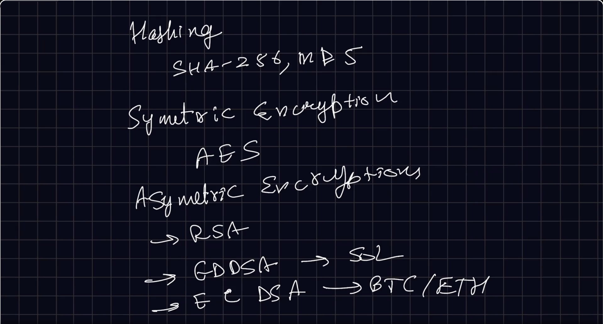
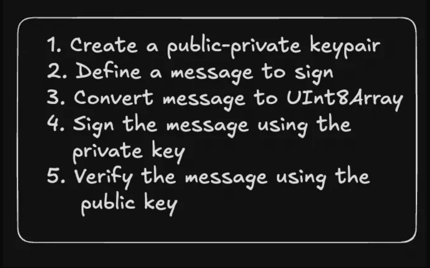

# Public Key Cryptography

# Steps 1 - 10

## 1 step

# Banks vs Blockchains

## Goal of today's class

- Create a simple web based wallet
- Look at the codebase of some wallets to see how they generate private keys

## How banks do Auth

In traditional banks, you have a username and password that are enough for you to:

- Look at your funds
- Transfer funds
- Look at your existing transactions

## How Blockchains do auth

If you ever want to create an account on a blockchain, you need to generate a public-private keypair.

### Public private Keypair

A public-private key pair is a set of two keys used in asymmetric cryptography. These two keys have the following characteristics:

**Public Key:** The public key is a string that can be shared openly.

For example - https://etherscan.io/address/0xD9a657ACB3960DB92AaaA32942019bD3c473FCCB

**Private key:** The private key is a secret string that must be kept confidential.

---

## Key Differences

| Banks                      | Blockchains                  |
| -------------------------- | ---------------------------- |
| Username + Password        | Public-Private Key Pair      |
| Centralized Authentication | Cryptographic Authentication |
| Account Recovery Possible  | Self-Custody (No Recovery)   |
| Regulated Environment      | Decentralized Environment    |

## Learning Objectives

By the end of this module, you should understand:

- The fundamental difference between traditional banking authentication and blockchain authentication
- How public-private key pairs work in blockchain systems
- The importance of private key security
- How to generate and manage cryptocurrency wallets

---

## 2 step

# Bits and bytes

## What is a Bit?

A bit is the smallest unit of data in a computer and can have one of two values: 0 or 1.

Think of a bit like a light switch that can be either off (0) or on (1).

## What is a byte?

A byte is a group of 8 bits. It's the standard unit of data used to represent a single character in memory. Since each bit can be either 0 or 1, a byte can have 2^8 (256) possible values, ranging from 0 to 255

## Assignment

What is the 11001010 converted to a decimals ?

**Answer:** 202

## Representing bits and bytes in JS

### Bit

```javascript
const x = 0;
console.log(x);
```

### Byte

```javascript
const x = 202;
console.log(x);
```

### Array of bytes

```javascript
const bytes = [202, 244, 1, 23];
console.log(bytes);
```

### UInt8Array

A better way to represent an array of bytes is to use a UInt8Array in JS

```javascript
let bytes = new Uint8Array([0, 255, 127, 128]);
console.log(bytes);
```

## Why use UInt8Array over native arrays ?

- They use less space. Every number takes 64 bits (8 bytes). But every value in a UInt8Array takes 1 byte.
- UInt8Array Enforces constraints - It makes sure every element doesn't exceed 255.

## Assignment

What do you think happens to the first element here? Does it throw an error?

```javascript
let uint8Arr = new Uint8Array([0, 255, 127, 128]);
uint8Arr[1] = 300;
```

---

## 3 step

# Encodings

Bytes are cool but highly unreadable. Imagine telling someone:

_Hey, my name is 00101011101010101020_

It's easier to encode data so it is more human readable. Some common encodings include:

- Ascii
- Hex
- Base64
- Base58

## Ascii

**1 character = 7 bits**

Every byte corresponds to a text on the computer.

Here is a complete list - [ASCII Character Set](https://www.w3schools.com/charsets/ref_html_ascii.asp#:~:text=The ASCII Character Set&text=ASCII is a 7-bit,are all based on ASCII.)

### Bytes to Ascii

```javascript
// Convert bytes to ASCII
```

### Ascii to bytes

```javascript
// Convert ASCII to bytes
```

### UInt8Array to ascii

```javascript
// Convert UInt8Array to ASCII
```

### Ascii to UInt8Array

```javascript
// Convert ASCII to UInt8Array
```

## Hex

**1 character = 4 bits**

A single hex character can be any of the 16 possible values: 0-9 and A-F.

### Array to hex

```javascript
// Convert array to hex
```

### Hex to array

```javascript
// Convert hex to array
```

Ref - [parseInt() - JavaScript | MDN](https://developer.mozilla.org/en-US/docs/Web/JavaScript/Reference/Global_Objects/parseInt)

## Base64

**1 character = 6 bits**

Base64 encoding uses 64 different characters (A-Z, a-z, 0-9, +, /), which means each character can represent one of 64 possible values.

- [Base64 Encode](https://www.base64encode.org/)
- [Base64 Decode](https://www.base64decode.org/)

### Encode

```javascript
// Base64 encoding example
```

## Base58

It is similar to Base64 but uses a different set of characters to avoid visually similar characters and to make the encoded output more user-friendly.

Base58 uses 58 different characters:

- Uppercase letters: A-Z (excluding I and O)
- Lowercase letters: a-z (excluding l)
- Numbers: 1-9 (excluding 0)
- +, /

### Encode

```javascript
// Base58 encoding example
```

### Decode

```javascript
// Base58 decoding example
```

## Ascii vs UTF-8

- **ASCII** uses a 7-bit encoding scheme.
- **UTF-8** uses 1 to 4 bytes to encode each character.

[UTF-8 Character List](https://www.fileformat.info/info/charset/UTF-8/list.htm)

---

## 4 step

# Hashing vs encryption

## Hashing

Hashing is a process of converting data (like a file or a message) into a fixed-size string of characters, which typically appears random.

**Common hashing algorithms:** SHA-256, MD5

## Encryption

Encryption is the process of converting plaintext data into an unreadable format, called ciphertext, using a specific algorithm and a key. The data can be decrypted back to its original form only with the appropriate key.

### Key Characteristics:

- **Reversible:** With the correct key, the ciphertext can be decrypted back to plaintext.
- **Key-dependent:** The security of encryption relies on the secrecy of the key.

### Two main types:

1. **Symmetric encryption:** The same key is used for both encryption and decryption.
2. **Asymmetric encryption:** Different keys are used for encryption (public key) and decryption (private key).

## Symmetric encryption

### Code

```javascript
const crypto = require("crypto");

// Generate a random encryption key
const key = crypto.randomBytes(32); // 32 bytes = 256 bits
const iv = crypto.randomBytes(16); // Initialization vector (IV)

// Function to encrypt text
function encrypt(text) {
  const cipher = crypto.createCipheriv("aes-256-cbc", key, iv);
  let encrypted = cipher.update(text, "utf8", "hex");
  encrypted += cipher.final("hex");
  return encrypted;
}

// Function to decrypt text
function decrypt(encryptedText) {
  const decipher = crypto.createDecipheriv("aes-256-cbc", key, iv);
  let decrypted = decipher.update(encryptedText, "hex", "utf8");
  decrypted += decipher.final("utf8");
  return decrypted;
}

// Example usage
const textToEncrypt = "Hello, World!";
const encryptedText = encrypt(textToEncrypt);
const decryptedText = decrypt(encryptedText);

console.log("Original Text:", textToEncrypt);
console.log("Encrypted Text:", encryptedText);
console.log("Decrypted Text:", decryptedText);
```

## Step 5

## Asymmetric encryption

Asymmetric encryption, also known as public-key cryptography, is a type of encryption that uses a pair of keys: a public key and a private key. The keys are mathematically related, but it is computationally infeasible to derive the private key from the public key.

**Public Key:** The public key is a string that can be shared openly

**Private Key:** The private key is a secret cryptographic code that must be kept confidential. It is used to decrypt data encrypted with the corresponding public key or to create digital signatures.

### Common Asymmetric Encryption Algorithms:

- **RSA** - Rivest–Shamir–Adleman
- **ECC** - Elliptic Curve Cryptography (ECDSA) - ETH and BTC
- **EdDSA** - Edwards-curve Digital Signature Algorithm - SOL

### How elliptic curves work

[Elliptic Curves Explained](https://www.youtube.com/watch?v=NF1pwjL9-DE&)

### Common elliptic curves

- **secp256k1** - BTC and ETH
- **ed25519** - SOL

### Few use cases of public key cryptography:

- SSL/TLS certificates
- SSH keys to connect to servers/push to github
- Blockchains and cryptocurrencies



---

## 6 step

# Creating a public/private keypair

Let's look at various ways of creating public/private keypairs, signing messages and verifying them

## EdDSA - Edwards-curve Digital Signature Algorithm - ED25519

### Using @noble/ed25519

```javascript
// Example using @noble/ed25519
```

### Using @solana/web3.js

```javascript
// Example using @solana/web3.js
```

## ECDSA (Elliptic Curve Digital Signature Algorithm) - secp256k1

### Using @noble/secp256k1

```javascript
// Example using @noble/secp256k1
```

### Using ethers

```javascript
// Example using ethers
```



---

## 7 step

# How to transactions work on the blockchain?

Ref - [Anders Brownworth's Blockchain Demo](https://andersbrownworth.com/blockchain/)

## User side

1. User first creates a public/private keypair
2. They create a transaction that they want to do (send Rs 50 to Alice). The transaction includes all necessary details like the recipient's address, the amount and some blockchain specific parameters (for eg - latestBlockHash in case of solana)
3. They hash the transaction
4. They sign the transaction using their private key
5. They send the raw transaction, signature and their public key to a node on the blockchain.

## Miner

1. Hashes the original message to generate a hash
2. Verifies the signature using the users public key and the hash generated in step 1
3. Transaction validation - The miner/validator checks additional aspects of the transaction, such as ensuring the user has sufficient funds
4. If everything checks out, adds the transaction to the block

---

## 8 step

# Hierarchical Deterministic (HD) Wallet

Hierarchical Deterministic (HD) wallets are a type of wallet that can generate a tree of key pairs from a single seed. This allows for the generation of multiple addresses from a single root seed, providing both security and convenience.

## Problem

You have to maintain/store multiple public private keys if you want to have multiple wallets.

## Solution - BIP-32

Bitcoin Improvement Proposal 32 (BIP-32) provided the solution to this problem in 2012. It was proposed by Pieter Wuilla, a Bitcoin Core developer, to simplify the recovery process of crypto wallets. BIP-32 introduced a hierarchical tree-like structure for wallets that allowed you to manage multiple accounts much more easily than was previously possible. It's essentially a standardized way to derive private and public keys from a master seed.

---

## 9 step

# How to create a wallet

## Mnemonics

A mnemonic phrase (or seed phrase) is a human-readable string of words used to generate a cryptographic seed. BIP-39 (Bitcoin Improvement Proposal 39) defines how mnemonic phrases are generated and converted into a seed.

Ref - [BIP-39 English Word List](https://github.com/bitcoin/bips/blob/master/bip-0039/english.txt)

Where this is done in Backpack - [MnemonicInput.tsx](https://github.com/coral-xyz/backpack/blob/master/packages/app-extension/src/components/common/Account/MnemonicInput.tsx#L143)

### Code

```javascript
import { generateMnemonic } from "bip39";

// Generate a 12-word mnemonic
const mnemonic = generateMnemonic();
console.log("Generated Mnemonic:", mnemonic);
```

Ref - [YouTube Short Explanation](https://www.youtube.com/shorts/ojBIcnPOk6k)

## Seed phrase

The seed is a binary number derived from the mnemonic phrase.

```javascript
import { generateMnemonic, mnemonicToSeedSync } from "bip39";

const mnemonic = generateMnemonic();
console.log("Generated Mnemonic:", mnemonic);
const seed = mnemonicToSeedSync(mnemonic);
```

Ref - [Backpack Keyring Implementation](https://github.com/coral-xyz/backpack/blob/master/packages/secure-background/src/services/svm/keyring.ts#L131)

## Derivation paths

Derivation paths specify a systematic way to derive various keys from the master seed.

They allow users to recreate the same set of addresses and private keys from the seed across different wallets, ensuring interoperability and consistency. (for example if you ever want to port from Phantom to Backpack)

A derivation path is typically expressed in a format like `m / purpose' / coin_type' / account' / change / address_index`.

- **m**: Refers to the master node, or the root of the HD wallet.
- **purpose**: A constant that defines the purpose of the wallet (e.g., 44' for BIP44, which is a standard for HD wallets).
- **coin_type**: Indicates the type of cryptocurrency (e.g., 0' for Bitcoin, 60' for Ethereum, 501' for solana).
- **account**: Specifies the account number (e.g., 0' for the first account).
- **change**: This is either 0 or 1, where 0 typically represents external addresses (receiving addresses), and 1 represents internal addresses (change addresses).
- **address_index**: A sequential index to generate multiple addresses under the same account and change path.

```javascript
import nacl from "tweetnacl";
import { generateMnemonic, mnemonicToSeedSync } from "bip39";
import { derivePath } from "ed25519-hd-key";
import { Keypair } from "@solana/web3.js";

const mnemonic = generateMnemonic();
const seed = mnemonicToSeedSync(mnemonic);
for (let i = 0; i < 4; i++) {
  const path = `m/44'/501'/${i}'/0'`; // This is the derivation path
  const derivedSeed = derivePath(path, seed.toString("hex")).key;
  const secret = nacl.sign.keyPair.fromSeed(derivedSeed).secretKey;
  console.log(Keypair.fromSecretKey(secret).publicKey.toBase58());
}
```

Ref SOL - [Solana Config](https://github.com/coral-xyz/backpack/blob/master/packages/secure-background/src/blockchain-configs/solana/config.ts#L38)

[Solana Util](https://github.com/coral-xyz/backpack/blob/master/packages/secure-background/src/services/svm/util.ts#L22)
